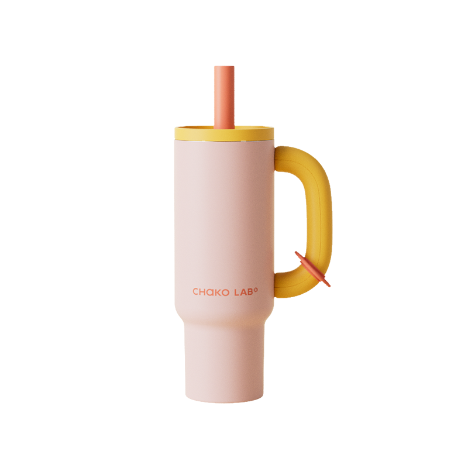

# ✅ 이미지 저장 완료!

## 🎉 성공적으로 완료되었습니다!

모든 이미지가 프로젝트에 로컬로 저장되었으며, HTML이 업데이트되었습니다.

---

## 📦 저장된 이미지

### 1. 차코랩 로고
- **파일**: `images/logo.png`
- **크기**: 24,990 bytes (약 24.4 KB)
- **형식**: PNG
- **사용 위치**:
  - 네비게이션 좌측 상단 로고
  - 히어로 섹션 중앙 대형 로고

### 2. 텀블러 배경 이미지
- **파일**: `images/tumbler-background.png`
- **크기**: 209,653 bytes (약 204.7 KB)
- **형식**: PNG
- **사용 위치**:
  - 섹션 1-5 배경 이미지
  - 스크롤에 따라 1x → 2x 줌 애니메이션

---

## 🔄 업데이트된 내용

### HTML 변경사항:

**이전 (외부 링크):**
```html


```

**현재 (로컬 이미지):**
```html


```

---

## ✨ 장점

### ✅ 외부 의존성 제거
- 젠스파크 서버에 의존하지 않음
- 링크 만료 걱정 없음
- 완전히 독립적인 프로젝트

### ✅ 빠른 로딩 속도
- 같은 서버에서 제공
- 외부 요청 없음
- CDN 사용 가능

### ✅ 오프라인 작동
- 인터넷 없이도 작동
- 로컬 개발 가능
- 완전한 통제권

### ✅ 배포 간편
- 모든 파일 포함
- 추가 설정 불필요
- 어디든 배포 가능

---

## 📁 현재 프로젝트 구조

```
chako-lab-website/
├── index.html
├── css/
│   └── style.css
├── js/
│   └── main.js
├── images/                    ← 새로 추가!
│   ├── logo.png              ← 24.4 KB
│   └── tumbler-background.png ← 204.7 KB
├── .github/
│   └── workflows/
│       └── deploy.yml
├── .vscode/
│   ├── settings.json
│   ├── tasks.json
│   └── extensions.json
├── README.md
├── IMAGE_GUIDE.md            ← 이미지 관리 가이드
├── AUTO_PUSH_GUIDE.md
├── DEPLOY.md
├── UNLIMITED_HOSTING_GUIDE.md
├── push.sh
├── push.bat
└── .gitignore
```

---

## 🎯 다음 단계

### 1. 이미지 교체 방법

새 이미지를 사용하려면:

```bash
# 방법 1: 같은 파일명으로 교체
cp 새로고.png images/logo.png
cp 새배경.png images/tumbler-background.png

# 방법 2: 다른 이름으로 저장 후 HTML 수정
cp 새로고.png images/new-logo.png
# HTML에서 src="images/new-logo.png"로 변경
```

### 2. 이미지 최적화

현재 총 용량: **234.4 KB**

최적화 후 예상: **100-150 KB** (40-60% 감소)

**최적화 도구:**
- [TinyPNG](https://tinypng.com/) - 무료, 쉬움
- [Squoosh](https://squoosh.app/) - Google 제공
- [Compressor.io](https://compressor.io/) - 온라인

### 3. WebP 변환 (선택)

더 작은 파일 크기를 원한다면:

```bash
# Squoosh.app에서 변환
# logo.png → logo.webp (50-70% 감소)
# tumbler-background.png → tumbler-background.webp (70-80% 감소)
```

---

## 📖 상세 가이드

모든 이미지 관리 방법은 **`IMAGE_GUIDE.md`** 파일에서 확인하세요!

```bash
# 가이드 읽기
cat IMAGE_GUIDE.md
```

**포함 내용:**
- ✅ 이미지 교체 방법
- ✅ 최적화 가이드
- ✅ 반응형 이미지 설정
- ✅ WebP 변환
- ✅ Lazy Loading
- ✅ 파일명 규칙
- ✅ 문제 해결 (FAQ)

---

## 🚀 배포 준비 완료

이제 프로젝트는 완전히 독립적이며 어디든 배포할 수 있습니다!

### 배포 옵션:

1. **Publish 탭** (현재 환경)
   - 원클릭 배포
   - 즉시 라이브 URL

2. **GitHub Pages** (무료, 영구)
   - 파일 업로드
   - Settings → Pages
   - `https://username.github.io/chako-lab-website/`

3. **Netlify** (드래그 & 드롭)
   - 폴더 드래그
   - 즉시 배포
   - 자동 HTTPS

4. **Vercel, Cloudflare Pages** 등
   - GitHub 연동
   - 자동 배포

자세한 내용: **UNLIMITED_HOSTING_GUIDE.md**

---

## 🔍 확인 사항

### ✅ 체크리스트:

- [x] 이미지 다운로드 완료
- [x] `images/` 폴더 생성
- [x] `logo.png` 저장 (24.4 KB)
- [x] `tumbler-background.png` 저장 (204.7 KB)
- [x] HTML 경로 업데이트 (3곳)
- [x] 외부 링크 제거
- [x] 로컬 경로로 변경
- [x] 가이드 문서 작성
- [x] README 업데이트

### 🧪 테스트:

브라우저에서 확인:
- [ ] 네비게이션 로고 표시되는지
- [ ] 히어로 섹션 로고 표시되는지
- [ ] 배경 이미지 표시되는지
- [ ] 스크롤 줌 애니메이션 작동하는지
- [ ] 모바일에서도 정상 작동하는지

---

## 💡 추가 팁

### 이미지 추가하기

더 많은 이미지를 추가하려면:

```bash
# 1. images/ 폴더에 저장
images/
├── logo.png
├── tumbler-background.png
├── product-01.png          ← 새 이미지
└── icon-instagram.svg      ← 새 이미지

# 2. HTML에서 사용

```

### 파일 이름 규칙

```
✅ 좋은 예:
- logo.png
- tumbler-background.png
- product-image-01.jpg
- icon-instagram.svg

❌ 나쁜 예:
- 로고.png (한글)
- Logo.PNG (대문자)
- tumbler background.png (공백)
- IMG_1234.jpg (의미 없음)
```

---

## 🎁 보너스: Git 커밋 메시지

이미지를 Git에 커밋할 때:

```bash
git add images/
git commit -m "feat: Add local images (logo, tumbler background)

- Add logo.png (24.4 KB)
- Add tumbler-background.png (204.7 KB)
- Update HTML to use local image paths
- Remove external image dependencies"

git push origin main
```

---

## ❓ FAQ

### Q: 이미지가 보이지 않아요
A: 경로를 확인하세요:
```html
<!-- 올바른 경로 -->


<!-- 잘못된 경로 -->
    (폴더명 오타)
          (대소문자 불일치)
```

### Q: 다른 이미지를 추가하려면?
A: 
1. `images/` 폴더에 파일 복사
2. HTML에서 사용: ``

### Q: 이미지를 최적화해야 하나요?
A: 현재 총 234KB로 괜찮지만, 최적화하면:
- 로딩 속도 ⬆️
- 대역폭 사용 ⬇️
- SEO 점수 ⬆️

### Q: 원본 이미지를 백업하려면?
A: 
```bash
# 백업 폴더 생성
mkdir images-backup
cp -r images/* images-backup/

# 또는 압축
zip -r images-backup.zip images/
```

---

## 🎉 축하합니다!

이제 CHAKO LAB 웹사이트는:
- ✅ 완전히 독립적
- ✅ 외부 의존성 없음
- ✅ 어디든 배포 가능
- ✅ 오프라인 작동
- ✅ 빠른 로딩

**다음 작업:**
1. 이미지 최적화 (선택)
2. 추가 이미지 저장 (선택)
3. 배포 (GitHub Pages / Netlify / Publish 탭)

---

더 궁금한 점이 있으시면 언제든 말씀해주세요! 😊

**관련 가이드:**
- `IMAGE_GUIDE.md` - 이미지 관리
- `AUTO_PUSH_GUIDE.md` - GitHub 푸시
- `UNLIMITED_HOSTING_GUIDE.md` - 호스팅
